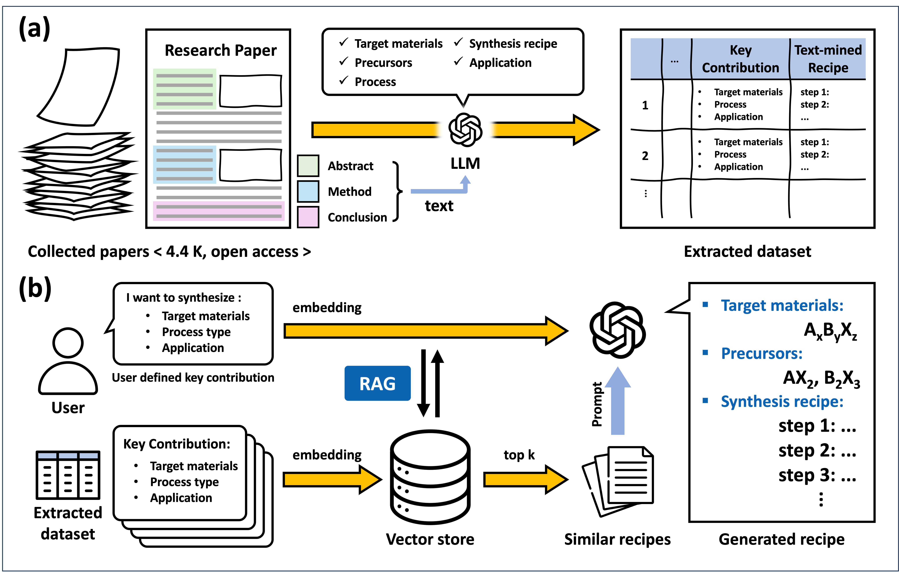

# Recipe Recommendations for Inorganic Solid-State Synthesis    

Original paper: [TBU]

Dataset: [https://huggingface.co/datasets/wjsehdrnfl428/dataset_for_recipe_generator](https://huggingface.co/datasets/wjsehdrnfl428/dataset_for_recipe_generator)     

---

This repository provides a retrieval-augmented generation pipeline for literature-guided recipe prediction in inorganic solid-state synthesis. The workflow first constructs a structured dataset from synthesis papers and then generates a stepwise synthesis recipe from user-defined key contributions.


Figure 1. Schematic diagram illustrating the process of (a) constructing the synthesis recipe database and (b) inferring a synthesis recipe using the RAG method. 

## Overview

The repository contains two main components.

1. Dataset construction from published solid-state synthesis papers [Hugging Face](https://huggingface.co/datasets/wjsehdrnfl428/dataset_for_recipe_generator)     

2. Recipe generation pipeline through retrieval-augmented generation

In the dataset construction stage, large language models are used to extract structured information from research papers, including target materials, precursors, process type, application, and stepwise synthesis recipes. These extracted records are then organized into a recipe dataset.

In the recipe generation stage, the user specifies a target material, process type, application, and other constraints (optional). The input is converted into a key contribution, which is used to retrieve semantically similar examples from the dataset. The retrieved examples are then provided as references for recipe generation.

## Dataset structure

Each dataset entry is organized around two main fields.

- `contribution`  
  A compact representation of the synthesis target, including
  - target materials
  - process type
  - application

- `recipe`  
  A structured stepwise synthesis recipe extracted from the literature

Additional metadata may include fields such as precursor information, process labels, and contribution embeddings used for retrieval.

## How the dataset is used

The dataset is used in two stages.

1. Retrieval  
   The user input is embedded and compared against the stored `contribution` embeddings to identify similar literature examples.

2. Generation  
   The retrieved examples, including their `contribution` and `recipe`, are used as fixed references for recipe generation.

This allows the model to generate a literature-guided recipe rather than a purely free-form response.

## Repository structure

- `demo.py`  
  Streamlit-based web interface for interactive recipe generation

- `predict.py`  
  Core prediction pipeline for retrieval-augmented recipe generation

- `benchmark/`  
  Benchmark scripts and evaluation utilities for recipe prediction experiments

- `experiment/`  
  Prediction utilities, prompts, and experimental scripts used for recipe generation and evaluation

- `requirements.txt`  
  Python package dependencies

## Installation

Create a Python environment and install the required packages.

```bash
pip install -r requirements.txt
```

## Web demo usage

Try our website([https://ssr.recipe-generator.site/](https://ssr.recipe-generator.site/)) or run the Streamlit demo with

```bash
streamlit run demo.py
```

The web demo follows the steps below.

1. Enter your personal OpenAI API key.
2. Check that the models supported in this demo are enabled for your OpenAI project.
   In the OpenAI Platform, go to `Settings > {your project} > Limits` and confirm that the following models are available under your project settings.

```python
model_options = [
    "gpt-4.1-mini",
    "gpt-4o-mini",
    "gpt-5.2",
    "gpt-5-mini",
    "gpt-5",
    "o3",
    "o3-mini",
    "o3-mini-low",
    "o3-mini-high"
]
```

3. Click the `Update` button after entering the API key.
4. Fill in the prediction inputs.
   - `Material Name`: target compound or composition
   - `Synthesis Technique`: process type to guide recipe generation
   - `Application`: intended use of the material, used to retrieve similar literature examples
5. Optionally adjust `Number of Retrievals`.
   - This controls how many retrieved literature recipes are used as reference exemplars for generation.
6. Optionally upload additional reference papers in PDF format.
   - Uploaded PDFs are parsed and used as additional user-provided references during recipe generation.
7. Click the `Recommend` button to generate a recipe.
8. The generated output includes
   - target materials
   - precursor list
   - stepwise synthesis recipe
9. A `retrieval confidence` score is displayed with the generated recipe.
   - This score indicates how well the retrieved reference recipes match the input query.
10. Use the chat box below the generated response for follow-up questions or recipe revision requests.
11. The generated recipe is a literature-guided suggestion and should be experimentally validated.

If the API key is copied with unintended spaces, tabs, or line breaks, the demo removes these whitespace characters automatically before validation.

## Example input

```text
Material Name: LiGa(SeO3)2
Synthesis Technique: mechanochemical process
Application: solid-state electrolyte
```

## Example output format

```text
## Target_Materials
LiGa(SeO3)2

## Precursors
- Li2CO3
- Ga2O3
- SeO2

## Synthesis Recipe
Step 1: ...
Step 2: ...
Step 3: ...
```


## Notes

The generated recipe is a literature-guided synthesis suggestion and should be experimentally validated. The retrieval and generation outputs depend on the selected model, available API access, and user-provided inputs.

## Contacts
e-mail: [jdwjyl2007@ajou.ac.kr](mailto:jdwjyl2007@ajou.ac.kr)
